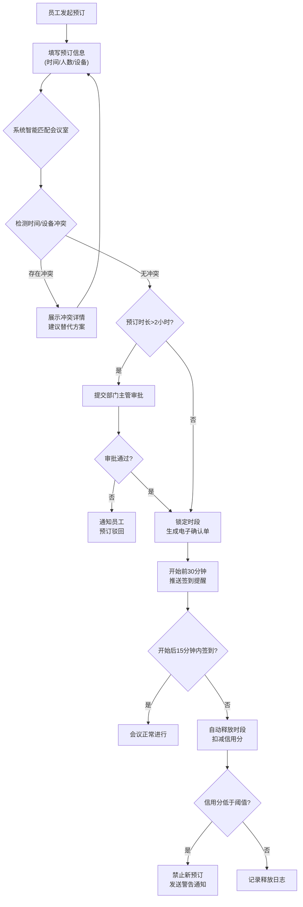
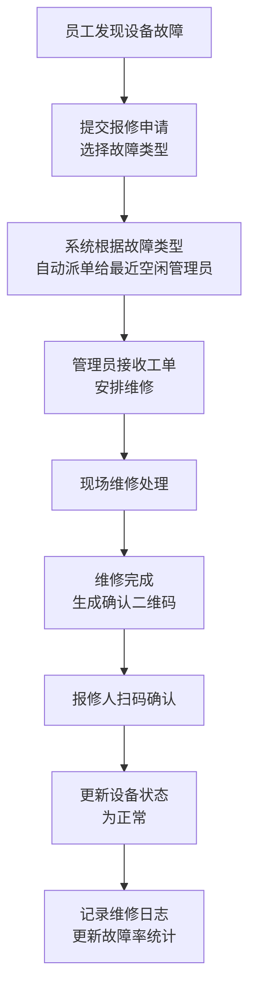
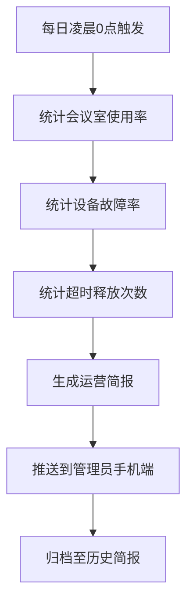

# 企业内部会议室与设备预约管理平台 - 产品需求文档

## 1. 产品概述

企业内部会议室与设备预约管理平台是一个面向企业内部的协同办公系统，旨在解决企业会议室资源分配不均、设备管理混乱、预订流程繁琐等痛点问题。平台支持员工、部门主管和行政管理员三种角色协同使用，通过智能化的资源匹配、自动化的审批与提醒机制，以及精细化的数据分析，全面提升企业办公资源的利用效率。

- **核心价值**：智能化资源调度、全流程自动化管理、数据驱动的运营决策
- **目标用户**：企业全体员工、部门主管、行政管理人员
- **产品定位**：企业级办公资源智能管理平台

## 2. 核心功能

### 2.1 用户角色

| 角色 | 注册方式 | 核心权限 |
|------|----------|----------|
| 员工 | 企业内部账号系统同步 | 预订会议室、使用设备、签到/签退、发起报修、查看信用分 |
| 部门主管 | 企业内部账号系统同步 + 角色授权 | 员工权限 + 审批超过2小时的长期预订、查看部门预订统计 |
| 行政管理员 | 超级管理员授权 | 全部权限 + 管理会议室/设备档案、维护排期、查看运营数据、处理设备报修工单 |

### 2.2 功能模块

1. **登录与角色切换**：统一登录入口，根据账号角色自动加载对应功能模块
2. **仪表盘（Dashboard）**：根据角色展示个性化数据概览
3. **会议室预订模块**：智能匹配、冲突检测、时段锁定、电子确认单
4. **审批管理模块**：部门主管审批超2小时的预订申请
5. **会议室管理模块**：会议室档案创建、编辑、状态管理
6. **设备管理模块**：设备档案、维护排期、故障报修、工单管理
7. **统计分析模块**：使用率热力图、超时释放统计、设备故障率、运营简报
8. **个人中心模块**：信用分查看、我的预订、消息通知、报修记录

### 2.3 页面详情

| 页面名称 | 模块名称 | 功能描述 |
|----------|----------|----------|
| 登录页 | 登录表单 | 账号密码登录、角色展示、记住密码 |
| 员工仪表盘 | 数据概览 | 今日预订、即将开始的会议、信用分、快捷预订入口 |
| 员工仪表盘 | 我的预订列表 | 展示个人所有预订记录及状态 |
| 会议室预订页 | 会议室列表 | 按条件筛选（人数、设备、楼层）、状态展示、日历视图 |
| 会议室预订页 | 预订表单 | 时间选择、参会人数、设备需求、会议主题、实时校验 |
| 会议室预订页 | 冲突检测弹窗 | 展示时间/设备冲突详情及替代方案建议 |
| 预订确认页 | 电子确认单 | 展示预订详情、二维码、确认凭证下载 |
| 审批管理页 | 待审批列表 | 展示需审批的预订申请、快速通过/驳回 |
| 审批管理页 | 审批详情 | 预订信息、审批意见输入、历史审批记录 |
| 会议室管理页 | 会议室档案 | 会议室增删改查、容量配置、设备绑定、状态管理 |
| 设备管理页 | 设备档案 | 设备增删改查、分类管理、状态追踪 |
| 设备管理页 | 维护排期 | 维护计划制定、到期提醒、维护记录 |
| 报修工单页 | 工单列表 | 故障报修、自动派单、工单状态流转 |
| 报修工单页 | 扫码确认 | 维修完成后扫码确认、评价反馈 |
| 统计分析页 | 周使用率热力图 | 按会议室×时段展示使用热度可视化 |
| 统计分析页 | 超时释放统计 | 按会议室/部门统计超时释放次数与趋势 |
| 统计分析页 | 设备故障率 | 设备故障排行、维修时效分析 |
| 统计分析页 | 运营简报 | 每日自动生成、移动端推送、历史归档 |
| 个人中心页 | 信用分面板 | 当前信用分、扣减记录、恢复规则说明 |
| 个人中心页 | 消息中心 | 签到提醒、审批结果、维护通知、系统公告 |

## 3. 核心流程

### 3.1 会议室预订主流程

员工登录平台后，填写预订信息（时间、人数、设备需求），系统自动匹配符合条件的会议室并实时检测时间与设备冲突。若存在冲突则展示冲突详情并建议替代方案；若无冲突则锁定时段。如果预订时长超过2小时，系统自动提交至部门主管审批，审批通过后更新为已锁定状态；2小时以内的预订直接锁定。锁定后生成电子确认单，系统在会议开始前30分钟推送签到提醒。开始后15分钟未签到则自动释放时段并扣减预订人信用分，信用分低于阈值时禁止新预订。

### 3.2 设备报修流程

员工发现设备故障后，在平台提交报修申请并选择故障类型。系统根据故障类型和管理员位置自动派单给最近空闲的行政管理员。管理员接收工单后前往现场维修，维修完成后由报修人扫码确认，系统自动更新设备状态为正常，并记录维修日志用于设备故障率统计。

### 3.3 每日运营简报流程

每日凌晨0点，系统自动统计前一日所有会议室的使用率、设备故障率、超时释放情况等关键指标，生成结构化的运营简报，并通过消息推送至行政管理员的移动端。管理员可在平台中查看历史简报归档。

## 4. 用户界面设计

### 4.1 设计风格

- **主色调**：深邃商务蓝 `#1E3A5F`，传递专业、可信赖的企业级产品气质
- **辅助色**：活力青绿 `#10B981`（成功/正常状态）、警示橙 `#F59E0B`（提醒/待处理）、危险红 `#EF4444`（冲突/异常）
- **背景系统**：主背景采用分层蓝灰渐变（`#F8FAFC` → `#F1F5F9`），卡片使用纯白底配极细蓝边，营造清爽的企业办公氛围
- **按钮风格**：圆角6px的扁平按钮，主按钮采用渐变蓝填充配微投影，次按钮为描边样式，悬停时上浮1px并增强阴影
- **字体系统**：标题使用「思源黑体」Semibold，正文使用「Noto Sans SC」Regular，数字与时间等信息使用等宽字体增强可读性
- **布局风格**：左侧导航栏 + 顶部用户栏 + 主内容区的经典企业后台三段式布局，内容采用卡片式模块化组织，信息密度适中
- **图标风格**：统一使用 Lucide 线性图标，配合填充色块增强识别度，大小20px为主

### 4.2 页面设计概览

| 页面名称 | 模块名称 | UI元素风格 |
|----------|----------|-----------|
| 登录页 | 登录表单 | 深蓝渐变背景 + 毛玻璃效果登录卡片 + 品牌Logo + 企业标语 |
| 员工仪表盘 | 数据概览 | 4个统计卡片（今日会议/即将开始/信用分/本月预订数）+ 快捷预订大按钮 |
| 员工仪表盘 | 我的预订 | 时间轴样式列表，卡片左色条标识状态（绿=锁定/灰=已完成/红=已释放） |
| 会议室预订页 | 筛选区 | 横向筛选条：人数选择器 + 设备多选 + 楼层选择 + 日期范围 |
| 会议室预订页 | 日历视图 | 周视图时间轴网格，纵向为时段（每30分钟一格），横向为会议室，色块标识占用 |
| 会议室预订页 | 预订弹窗 | 两步式表单：第一步选会议室+时间，第二步填详情+设备，右侧实时预览冲突 |
| 审批管理页 | 审批列表 | 表格布局，每行含快速操作按钮（通过/驳回），超2小时的行高亮显示 |
| 会议室管理页 | 会议室档案 | 网格卡片，每卡片展示会议室照片、容量、设备图标组、状态开关 |
| 设备管理页 | 维护排期 | 甘特图样式时间轴，不同颜色区分已完成/进行中/待处理维护任务 |
| 统计分析页 | 热力图 | 7列×24行矩阵格子，颜色深浅表示使用率，悬停显示具体数据 |
| 统计分析页 | 超时统计 | 横向柱状图 + 折线趋势图组合，按部门/会议室维度切换 |
| 个人中心页 | 信用分 | 半圆形仪表盘动画展示当前分数，下方时间轴展示扣减/恢复记录 |

### 4.3 响应式设计

- **设计优先级**：桌面端优先（1440px为基准设计宽度），适配1080p和2K显示器
- **平板适配（≥768px）**：左侧导航栏可折叠为图标模式，内容区卡片自动换行
- **移动端适配（<768px）**：导航栏转为底部Tab栏，日历视图简化为日视图列表，表格转为卡片堆叠

### 4.4 微交互与动画

- **页面加载**：各模块卡片采用100ms间隔的错峰淡入上浮动画（stagger效果）
- **按钮交互**：悬停时 translateY(-1px) + 阴影加深，点击时 scale(0.97) 回弹
- **状态变更**：预订锁定、审批通过等成功操作后，卡片边框发出300ms的绿色脉冲光圈
- **冲突检测**：冲突项红色高亮并伴随轻微左右晃动提示
- **热力图加载**：格子从左到右、从上到下依次填充颜色，产生水波流动感
- **信用分仪表盘**：数字从0滚动到当前值，指针平滑过渡

## 5. 非功能性需求

### 5.1 性能要求
- 页面首屏加载时间 ≤ 2秒
- 预订冲突检测响应时间 ≤ 500ms
- 同时支持不少于500人在线操作
- 热力图等大数据可视化组件渲染 ≤ 1秒

### 5.2 数据校验要求
- 所有表单提交前进行实时前端校验
- 结束时间必须晚于开始时间
- 设备不可重复占用（同一时段同一设备仅能被一个预订使用）
- 输入长度、格式合法性校验
- 所有操作伴有明确的成功/失败错误提示

### 5.3 安全要求
- 角色权限严格隔离，禁止越权访问
- 敏感操作（审批、删除档案）需二次确认
- 操作日志完整记录，支持审计追溯
