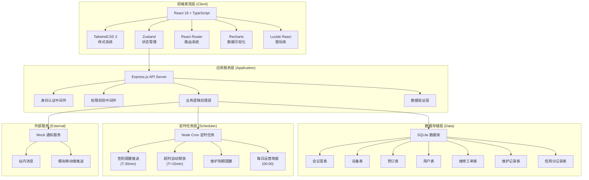
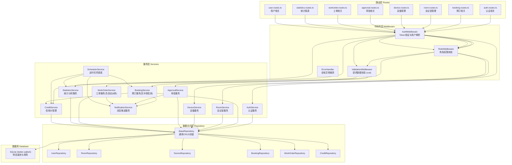
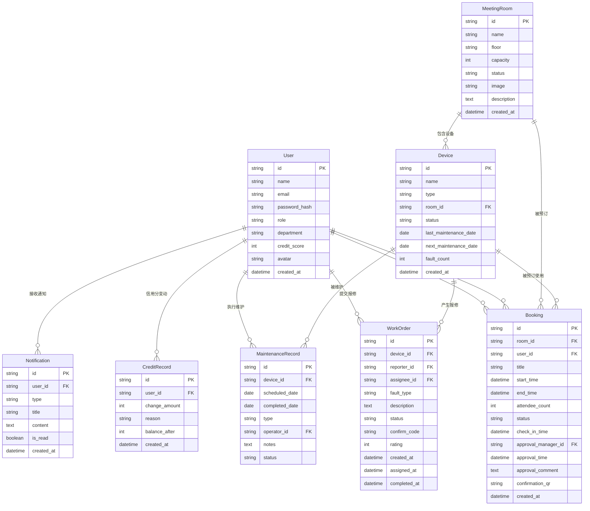

# 企业内部会议室与设备预约管理平台 - 技术架构文档

## 1. 架构设计



## 2. 技术描述

- **前端**：React@18 + TypeScript + Vite@5 + TailwindCSS@3 + Zustand@4 + React Router@6 + Recharts@2
- **初始化工具**：vite-init (react-express-ts 模板)
- **后端**：Express@4 + TypeScript
- **数据库**：SQLite（开发阶段使用 better-sqlite3，数据持久化存储）
- **图表库**：Recharts（React 生态轻量级图表库，支持热力图、柱状图、折线图等）
- **定时任务**：node-cron
- **图标**：lucide-react

## 3. 路由定义

| 路由路径 | 页面组件 | 访问角色 | 页面用途 |
|---------|---------|---------|---------|
| `/login` | LoginPage | ALL | 统一登录入口 |
| `/dashboard` | EmployeeDashboard | 员工/主管/管理员 | 个性化仪表盘，展示与角色相关的概览数据 |
| `/booking` | BookingPage | 员工/主管/管理员 | 会议室浏览、筛选与预订操作主页面 |
| `/booking/:id` | BookingDetailPage | 员工/主管/管理员 | 预订详情与电子确认单展示 |
| `/approvals` | ApprovalPage | 部门主管/管理员 | 预订审批列表与审批操作 |
| `/meeting-rooms` | MeetingRoomManagePage | 行政管理员 | 会议室档案增删改查管理 |
| `/devices` | DeviceManagePage | 行政管理员 | 设备档案、维护排期管理 |
| `/work-orders` | WorkOrderPage | 员工/管理员 | 设备报修工单列表与处理 |
| `/statistics` | StatisticsPage | 部门主管/管理员 | 使用率热力图、超时统计、故障率分析 |
| `/profile` | ProfilePage | 员工/主管/管理员 | 个人中心、信用分、消息通知 |

## 4. API 接口定义

### 4.1 TypeScript 类型定义

```typescript
// 用户角色
type UserRole = 'employee' | 'manager' | 'admin';

// 用户信息
interface User {
  id: string;
  name: string;
  email: string;
  role: UserRole;
  department: string;
  creditScore: number;
  avatar?: string;
}

// 会议室
interface MeetingRoom {
  id: string;
  name: string;
  floor: string;
  capacity: number;
  equipmentIds: string[];
  status: 'active' | 'maintenance' | 'disabled';
  image?: string;
  description?: string;
}

// 设备
interface Device {
  id: string;
  name: string;
  type: 'projector' | 'whiteboard' | 'video-conference' | 'microphone' | 'other';
  roomId?: string;
  status: 'normal' | 'faulty' | 'maintenance';
  lastMaintenanceDate?: string;
  nextMaintenanceDate?: string;
  faultCount: number;
}

// 预订状态
type BookingStatus = 'pending_approval' | 'locked' | 'completed' | 'released' | 'cancelled' | 'rejected';

// 预订记录
interface Booking {
  id: string;
  roomId: string;
  userId: string;
  title: string;
  startTime: string;
  endTime: string;
  attendeeCount: number;
  requiredDeviceIds: string[];
  status: BookingStatus;
  checkInTime?: string;
  approvalManagerId?: string;
  approvalTime?: string;
  approvalComment?: string;
  createdAt: string;
  confirmationQr?: string;
}

// 维修工单
type WorkOrderStatus = 'pending' | 'assigned' | 'processing' | 'completed' | 'cancelled';

interface WorkOrder {
  id: string;
  deviceId: string;
  reporterId: string;
  assigneeId?: string;
  faultType: string;
  description: string;
  status: WorkOrderStatus;
  createdAt: string;
  assignedAt?: string;
  completedAt?: string;
  confirmCode?: string;
  rating?: number;
}

// 维护记录
interface MaintenanceRecord {
  id: string;
  deviceId: string;
  scheduledDate: string;
  completedDate?: string;
  type: 'preventive' | 'corrective';
  operatorId: string;
  notes?: string;
  status: 'scheduled' | 'completed' | 'overdue';
}

// 信用分记录
interface CreditRecord {
  id: string;
  userId: string;
  change: number;
  reason: string;
  createdAt: string;
  balanceAfter: number;
}

// 运营简报
interface DailyReport {
  date: string;
  totalRooms: number;
  totalBookings: number;
  completedBookings: number;
  releasedBookings: number;
  averageUsageRate: number;
  deviceFaultCount: number;
  deviceRepairRate: number;
  roomUsageHeatmap: { roomId: string; hour: number; rate: number }[];
  topOverusedRooms: { roomId: string; roomName: string; count: number }[];
}

// API 响应基础类型
interface ApiResponse<T> {
  code: number;
  message: string;
  data: T;
}

// 预订冲突信息
interface BookingConflict {
  type: 'time' | 'device';
  conflictingBookingId?: string;
  roomName?: string;
  deviceName?: string;
  suggestedAlternatives?: { roomId: string; roomName: string; availableSlots: { start: string; end: string }[] }[];
}
```

### 4.2 REST API 端点

| 方法 | 路径 | 用途 | 请求参数 | 返回数据 |
|-----|------|-----|---------|---------|
| POST | `/api/auth/login` | 用户登录 | `{ email, password }` | `{ token, user }` |
| GET | `/api/users/current` | 获取当前用户信息 | - | `User` |
| GET | `/api/meeting-rooms` | 获取会议室列表 | `query: { floor?, minCapacity?, equipmentTypes?, date? }` | `MeetingRoom[]` |
| GET | `/api/meeting-rooms/:id` | 获取会议室详情 | - | `MeetingRoom` |
| POST | `/api/meeting-rooms` | 创建会议室（管理员） | `MeetingRoom` | `MeetingRoom` |
| PUT | `/api/meeting-rooms/:id` | 更新会议室（管理员） | `Partial<MeetingRoom>` | `MeetingRoom` |
| GET | `/api/devices` | 获取设备列表 | `query: { type?, status?, roomId? }` | `Device[]` |
| POST | `/api/devices` | 创建设备（管理员） | `Device` | `Device` |
| PUT | `/api/devices/:id` | 更新设备（管理员） | `Partial<Device>` | `Device` |
| POST | `/api/bookings/check-conflict` | 检测预订冲突 | `{ roomId, startTime, endTime, deviceIds }` | `{ hasConflict, conflicts: BookingConflict[] }` |
| GET | `/api/bookings` | 获取预订列表 | `query: { userId?, roomId?, status?, startDate?, endDate? }` | `Booking[]` |
| POST | `/api/bookings` | 创建预订 | `{ roomId, title, startTime, endTime, attendeeCount, requiredDeviceIds }` | `Booking` |
| GET | `/api/bookings/:id` | 获取预订详情 | - | `Booking` |
| POST | `/api/bookings/:id/check-in` | 签到 | - | `Booking` |
| POST | `/api/bookings/:id/cancel` | 取消预订 | - | `Booking` |
| GET | `/api/approvals/pending` | 获取待审批列表（主管） | - | `Booking[]` |
| POST | `/api/approvals/:bookingId` | 审批预订（主管） | `{ approved, comment }` | `Booking` |
| GET | `/api/work-orders` | 获取工单列表 | `query: { status?, reporterId?, assigneeId? }` | `WorkOrder[]` |
| POST | `/api/work-orders` | 提交报修 | `{ deviceId, faultType, description }` | `WorkOrder` |
| POST | `/api/work-orders/:id/assign` | 派单（管理员） | `{ assigneeId }` | `WorkOrder` |
| POST | `/api/work-orders/:id/complete` | 扫码确认完成 | `{ confirmCode, rating? }` | `WorkOrder` |
| GET | `/api/maintenance` | 获取维护排期 | `query: { deviceId?, status? }` | `MaintenanceRecord[]` |
| POST | `/api/maintenance` | 创建维护计划（管理员） | `MaintenanceRecord` | `MaintenanceRecord` |
| GET | `/api/statistics/usage-heatmap` | 获取使用率热力图数据 | `query: { weekStartDate }` | `DailyReport['roomUsageHeatmap']` |
| GET | `/api/statistics/overtime-release` | 获取超时释放统计 | `query: { startDate, endDate, groupBy: 'room' \| 'department' }` | 统计数据 |
| GET | `/api/statistics/device-faults` | 获取设备故障率 | `query: { startDate, endDate }` | 统计数据 |
| GET | `/api/reports/daily` | 获取每日运营简报 | `query: { date }` | `DailyReport` |
| GET | `/api/credit-scores/records` | 获取信用分记录 | `query: { userId }` | `CreditRecord[]` |
| GET | `/api/notifications` | 获取消息通知列表 | - | 通知列表 |

## 5. 服务端架构图



## 6. 数据模型

### 6.1 ER 图



### 6.2 DDL 语句

```sql
-- 用户表
CREATE TABLE IF NOT EXISTS users (
  id TEXT PRIMARY KEY,
  name TEXT NOT NULL,
  email TEXT UNIQUE NOT NULL,
  password_hash TEXT NOT NULL,
  role TEXT NOT NULL CHECK (role IN ('employee', 'manager', 'admin')),
  department TEXT NOT NULL,
  credit_score INTEGER NOT NULL DEFAULT 100,
  avatar TEXT,
  created_at DATETIME DEFAULT CURRENT_TIMESTAMP
);

-- 会议室表
CREATE TABLE IF NOT EXISTS meeting_rooms (
  id TEXT PRIMARY KEY,
  name TEXT NOT NULL,
  floor TEXT NOT NULL,
  capacity INTEGER NOT NULL,
  status TEXT NOT NULL DEFAULT 'active' CHECK (status IN ('active', 'maintenance', 'disabled')),
  image TEXT,
  description TEXT,
  created_at DATETIME DEFAULT CURRENT_TIMESTAMP
);

-- 设备表
CREATE TABLE IF NOT EXISTS devices (
  id TEXT PRIMARY KEY,
  name TEXT NOT NULL,
  type TEXT NOT NULL CHECK (type IN ('projector', 'whiteboard', 'video-conference', 'microphone', 'other')),
  room_id TEXT REFERENCES meeting_rooms(id),
  status TEXT NOT NULL DEFAULT 'normal' CHECK (status IN ('normal', 'faulty', 'maintenance')),
  last_maintenance_date DATE,
  next_maintenance_date DATE,
  fault_count INTEGER NOT NULL DEFAULT 0,
  created_at DATETIME DEFAULT CURRENT_TIMESTAMP
);

-- 预订表
CREATE TABLE IF NOT EXISTS bookings (
  id TEXT PRIMARY KEY,
  room_id TEXT NOT NULL REFERENCES meeting_rooms(id),
  user_id TEXT NOT NULL REFERENCES users(id),
  title TEXT NOT NULL,
  start_time DATETIME NOT NULL,
  end_time DATETIME NOT NULL,
  attendee_count INTEGER NOT NULL,
  status TEXT NOT NULL DEFAULT 'locked' CHECK (status IN ('pending_approval', 'locked', 'completed', 'released', 'cancelled', 'rejected')),
  check_in_time DATETIME,
  approval_manager_id TEXT REFERENCES users(id),
  approval_time DATETIME,
  approval_comment TEXT,
  confirmation_qr TEXT,
  created_at DATETIME DEFAULT CURRENT_TIMESTAMP
);

-- 预订-设备关联表（多对多）
CREATE TABLE IF NOT EXISTS booking_devices (
  booking_id TEXT NOT NULL REFERENCES bookings(id) ON DELETE CASCADE,
  device_id TEXT NOT NULL REFERENCES devices(id),
  PRIMARY KEY (booking_id, device_id)
);

-- 维修工单表
CREATE TABLE IF NOT EXISTS work_orders (
  id TEXT PRIMARY KEY,
  device_id TEXT NOT NULL REFERENCES devices(id),
  reporter_id TEXT NOT NULL REFERENCES users(id),
  assignee_id TEXT REFERENCES users(id),
  fault_type TEXT NOT NULL,
  description TEXT NOT NULL,
  status TEXT NOT NULL DEFAULT 'pending' CHECK (status IN ('pending', 'assigned', 'processing', 'completed', 'cancelled')),
  confirm_code TEXT,
  rating INTEGER,
  created_at DATETIME DEFAULT CURRENT_TIMESTAMP,
  assigned_at DATETIME,
  completed_at DATETIME
);

-- 维护记录表
CREATE TABLE IF NOT EXISTS maintenance_records (
  id TEXT PRIMARY KEY,
  device_id TEXT NOT NULL REFERENCES devices(id),
  scheduled_date DATE NOT NULL,
  completed_date DATE,
  type TEXT NOT NULL CHECK (type IN ('preventive', 'corrective')),
  operator_id TEXT NOT NULL REFERENCES users(id),
  notes TEXT,
  status TEXT NOT NULL DEFAULT 'scheduled' CHECK (status IN ('scheduled', 'completed', 'overdue'))
);

-- 信用分记录表
CREATE TABLE IF NOT EXISTS credit_records (
  id TEXT PRIMARY KEY,
  user_id TEXT NOT NULL REFERENCES users(id),
  change_amount INTEGER NOT NULL,
  reason TEXT NOT NULL,
  balance_after INTEGER NOT NULL,
  created_at DATETIME DEFAULT CURRENT_TIMESTAMP
);

-- 消息通知表
CREATE TABLE IF NOT EXISTS notifications (
  id TEXT PRIMARY KEY,
  user_id TEXT NOT NULL REFERENCES users(id),
  type TEXT NOT NULL,
  title TEXT NOT NULL,
  content TEXT NOT NULL,
  is_read INTEGER NOT NULL DEFAULT 0,
  created_at DATETIME DEFAULT CURRENT_TIMESTAMP
);

-- 创建索引以提升查询性能
CREATE INDEX IF NOT EXISTS idx_bookings_room_time ON bookings(room_id, start_time, end_time);
CREATE INDEX IF NOT EXISTS idx_bookings_user ON bookings(user_id);
CREATE INDEX IF NOT EXISTS idx_bookings_status ON bookings(status);
CREATE INDEX IF NOT EXISTS idx_workorders_status ON work_orders(status);
CREATE INDEX IF NOT EXISTS idx_devices_status ON devices(status);
CREATE INDEX IF NOT EXISTS idx_notifications_user ON notifications(user_id, is_read);
CREATE INDEX IF NOT EXISTS idx_credit_records_user ON credit_records(user_id);
```

### 6.3 初始数据（Mock Data）

系统初始化时自动创建以下演示数据：

1. **用户账号**（密码均为 `123456`）：
   - 员工：张三（zhangsan@corp.com）、李四（lisi@corp.com）、王五（wangwu@corp.com）
   - 部门主管：赵主管（zhaoguan@corp.com，技术部）
   - 行政管理员：刘管理员（liuguanli@corp.com）

2. **会议室**：5个典型会议室，覆盖8人小型讨论室至50人大会议厅

3. **设备**：投影仪、电子白板、视频会议系统、麦克风等共20+台设备

4. **预订数据**：包含过去2周及未来1周的模拟预订记录，用于统计功能演示

5. **工单数据**：包含待处理、处理中、已完成各状态的示例工单

## 7. 目录结构

```
1648/
├── src/                          # 前端源码
│   ├── components/               # 通用组件
│   │   ├── layout/               # 布局组件（导航、顶部栏、侧边栏）
│   │   ├── common/               # 通用UI（按钮、卡片、弹窗、表单元素）
│   │   └── business/             # 业务组件（预订卡片、工单卡片、热力图等）
│   ├── pages/                    # 页面组件
│   │   ├── Login.tsx
│   │   ├── Dashboard.tsx
│   │   ├── Booking.tsx
│   │   ├── BookingDetail.tsx
│   │   ├── Approvals.tsx
│   │   ├── MeetingRoomManage.tsx
│   │   ├── DeviceManage.tsx
│   │   ├── WorkOrders.tsx
│   │   ├── Statistics.tsx
│   │   └── Profile.tsx
│   ├── hooks/                    # 自定义 Hooks
│   ├── store/                    # Zustand 状态管理
│   ├── utils/                    # 工具函数（日期、校验、格式化等）
│   ├── types/                    # TypeScript 类型定义
│   ├── services/                 # API 请求封装
│   ├── App.tsx                   # 根组件（路由配置）
│   ├── main.tsx                  # 入口文件
│   └── index.css                 # 全局样式（Tailwind 指令）
├── api/                          # 后端源码
│   ├── routes/                   # 路由定义
│   ├── middleware/               # 中间件
│   ├── services/                 # 业务逻辑
│   ├── repository/               # 数据访问层
│   ├── database/                 # 数据库初始化与连接
│   ├── types/                    # 后端类型定义
│   ├── utils/                    # 后端工具函数
│   └── index.ts                  # Express 服务入口
├── shared/                       # 前后端共享类型
├── migrations/                   # 数据库迁移脚本
├── .trae/documents/              # 项目文档
├── package.json
├── tsconfig.json
├── vite.config.ts
├── tailwind.config.js
└── postcss.config.js
```
